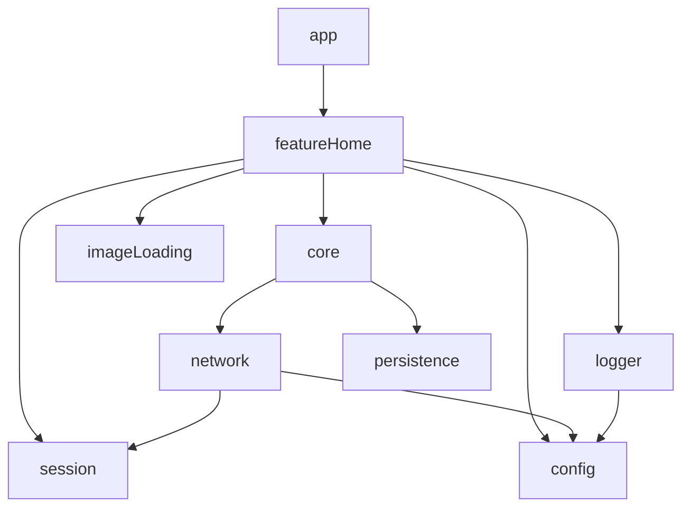

# Tapptitude's Android Template

A 100% Kotlin-based project template that helps us kick start our Android projects.

## Main features

- Dependencies managed through Gradle version catalogs `*.toml`
- Application signing, flavors & dimensions setup done
  through  `buildSrc` [(Kotlin DSL)](https://docs.gradle.org/current/userguide/kotlin_dsl.html)
- Supports `dev` & `production` flavors out of the box
- Lays the foundation for independent core business & presentation modules [`network`](#network), [`logger`](#logger),
  [`imageLoading`](#imageloading), [`persistence`](#persistence), [`session`](#session)
- Dependency updates management is done through [`gradle-versions`](https://github.com/ben-manes/gradle-versions-plugin)

## Quick setup

1. Click the [`Use this template`](https://github.com/tapptitude/AndroidKotlinMVVMTemplate/generate) button on this page
   to generate your own project using this template.
2. Update package name in [`Android`](buildSrc/src/main/kotlin/configuration/Android.kt)
   class and in [`AndroidManifest.xml`](app/src/main/AndroidManifest.xml).
3. Update signing configuration available in the Gradle DSL
   plugin [`SigningConfigPlugin`](buildSrc/src/main/kotlin/plugin/SigningConfigPlugin.kt)

## Gradle structure

The template uses Gradle Kotlin DSL for build setup.

Dependencies are organized into 3 `toml` configuration files:

1. [`dependencies.toml`](gradle/dependencies.toml) - contains app & module production dependencies
2. [`testDependencies.toml`](gradle/testDependencies.toml) - contains testing dependencies
2. [`androidTestDependencies.toml`](gradle/androidTestDependencies.toml) - contains instrumentation testing dependencies

Common module setup is done in [`GradleConfigExt`](buildSrc/src/main/kotlin/ext/GradleConfigExt.kt) and it is applied in
all `subprojects` of the whole project.

Android specific configuration is available in the [`Android`](buildSrc/src/main/kotlin/configuration/Android.kt)
class.

## Architecture considerations

This template adheres to the following architectural principles:

- An [MVVM](https://en.wikipedia.org/wiki/Model%E2%80%93view%E2%80%93viewmodel) (Model-View-ViewModel) approach has been
  used for facilitating the GUI / business separation concerns.
- The app module uses a single-activity architecture, based on
  the [Navigation component](https://developer.android.com/guide/navigation/navigation-getting-started) for navigation
  operations.
- It follows the [S.O.L.I.D.](https://en.wikipedia.org/wiki/SOLID) software principles which help increasing flexibility
  & maintainability while keeping the code readable.
- A modular approach was used in order to improve on
  the [separation of concerns](https://en.wikipedia.org/wiki/Separation_of_concerns) topic, while also helping with
  isolating feature functionalities. This aspect also helps on the build speed on the long run as only modified modules
  will be recompiled at each run.

## Modules

### app

The app module is the central place for all the other modules. It consists of a single `Activity` which hosts all the
navigation inside the app and provides basic UI functionality for `featureX` modules.

### featureHome

Represents a sample implementation of a `feature` module. It showcases how the `core` module provides all the needed
domain layer logic and the `feature` module focuses only on
the [presentation](https://developer.android.com/jetpack/guide/ui-layer) (also knows as the UI) layer.

### core

It gathers logic from `network` & `persistence` modules and creates the required infrastructure to host the business
level `Repositories` and `UseCases` that it later exposes to the `featureX` layer modules. It also hosts the UI models
and their respective converters. Most of the common business code is also hosted here (it's basically
a [domain layer](https://developer.android.com/jetpack/guide/domain-layer)).

### network

Provides a place to implement everything network. It handles everything related to API calls, DTO models, session
handling through authentication headers and network level error handling. It
uses [Retrofit](https://square.github.io/retrofit/) & [okhttp](https://square.github.io/okhttp/) for the network layer
implementation and [Moshi](https://github.com/square/moshi) for `json` parsing.

### persistence

WIP

### session

It handles everything related to a user session and saves current login state. Provides a way to listen for such state
changes, while giving data about the current user and authentication information.

### logger

Provides an implementation of basic console logging capabilities that can be easily extended to write to a file or any
other use case. It uses [Timber](https://github.com/JakeWharton/timber) in the underlying implementation.

### imageLoading

Provides an image loading solution for the presentation layer. It uses [Glide](https://github.com/bumptech/glide) for
the image loading side and provides a streamlined helper class that can be easily extended. Image loading logic provider
can be easily switched due to this abstraction layer.

### config

Provides build specific configuration to any module that needs it. Provided information is related to:

- app version code
- app version name
- app package identifier
- build flavor
- debug mode

## License

Copyright (c) 2022 [Tapptitude](https://www.tapptitude.com/)

Permission is hereby granted, free of charge, to any person obtaining a copy of this software and associated
documentation files (the "Software"), to deal in the Software without restriction, including without limitation the
rights to use, copy, modify, merge, publish, distribute, sublicense, and/or sell copies of the Software, and to permit
persons to whom the Software is furnished to do so, subject to the following conditions:

The above copyright notice and this permission notice shall be included in all copies or substantial portions of the
Software.

THE SOFTWARE IS PROVIDED "AS IS", WITHOUT WARRANTY OF ANY KIND, EXPRESS OR IMPLIED, INCLUDING BUT NOT LIMITED TO THE
WARRANTIES OF MERCHANTABILITY, FITNESS FOR A PARTICULAR PURPOSE AND NONINFRINGEMENT. IN NO EVENT SHALL THE AUTHORS OR
COPYRIGHT HOLDERS BE LIABLE FOR ANY CLAIM, DAMAGES OR OTHER LIABILITY, WHETHER IN AN ACTION OF CONTRACT, TORT OR
OTHERWISE, ARISING FROM, OUT OF OR IN CONNECTION WITH THE SOFTWARE OR THE USE OR OTHER DEALINGS IN THE SOFTWARE.